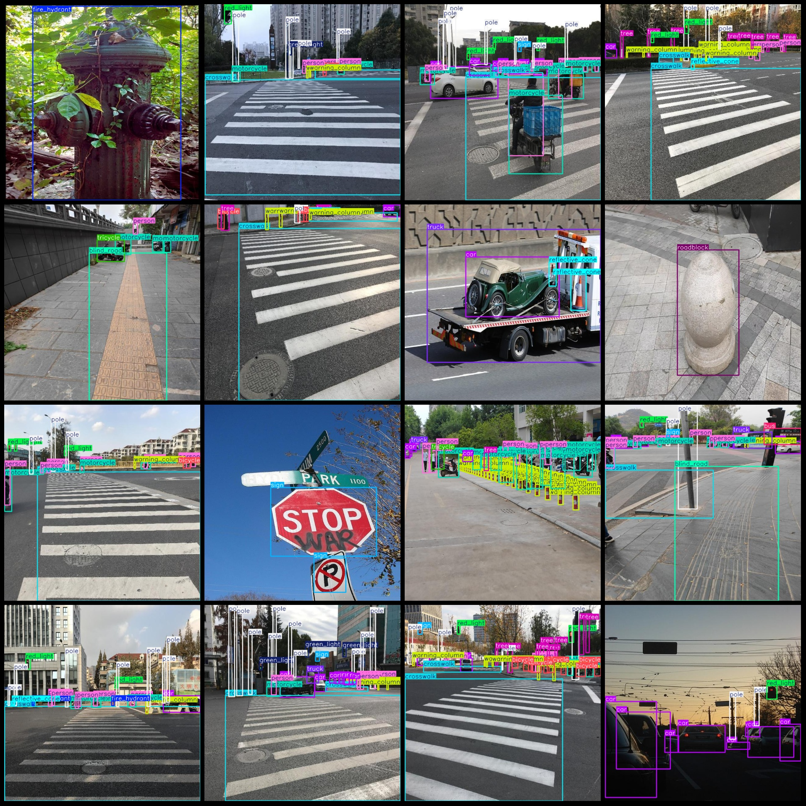
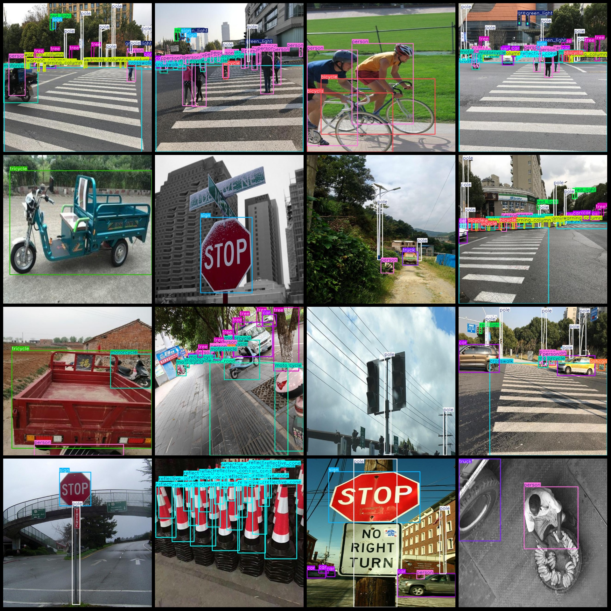

# Intelligent Traffic Full-Scene Vehicle and Pedestrian Traffic Light, Signs, Trees, Traffic Cone Object Detection Dataset VOC+YOLO Format 9977 Images 20 Categories

The dataset format is Pascal VOC format + YOLO format (the txt file does not contain the segmentation path, it only contains the jpg images and the corresponding VOC format xml files and yolo format txt files).
number of images: 9977  
The number of XML files is 9977.
Number of .txt files: 9977
The number of categories is 20.
The categories in the order of labels are: ["ashcan", "bicycle", "blind_road", "bus", "car", "crosswalk", "dog", "fire_hydrant", "green_light", "motorcycle", "person", "pole", "red_light", "reflective_cone", "roadblock", "sign", "tree", "tricycle", "truck", "warning_column"]
The number of boxes labeled in each category:
The number of ashcan (trash can) frames is 2064, and the number of pictures occupied is 1629.
The count of bicycles is 4368, and the number of images is 2243.
The number of frames for the "Blind Road" (Blind Path) is 1674, and the number of frames occupied by the image is 1232.
Bus box count = 1257, images = 956
Car box count = 19669, images = 5262
Crosswalk box count = 6132, images = 3777
Dog box count = 710, images = 551
Fire hydrant box count = 1004, images = 948
Green light frame count = 3551, occupied images = 2143
Motorcycle frame count = 8777, occupied images = 3099
Person frame count = 24993, occupied images = 5550
Pole frame count = 22242, occupied images = 6170
Red light frame count = 3508, occupied images = 2222
Reflective cone frame count = 2915, occupied images = 919
Roadblock frame count = 3192, occupied images = 791
Sign frame count = 2333, occupied images = 1783
Tree frame count = 16322, occupied images = 4668
Tricycle frame count = 1139, occupied images = 948
Truck frame count = 2533, occupied images = 1835
Warning column frame count = 7513, occupied images = 2227
Total frames: 135896  
Image resolution: 640x640  
Labeling tool used: labelImg
Annotation rules: Label the categories with rectangles.  
Special note: The dataset does not have a split into training, validation, and test sets, so you need to manually divide it.  
Special declaration: This dataset does not guarantee any accuracy for the models trained or weight files.
Preview of the image:
## Images

Here is a pay link on Stripe ( https://buy.stripe.com/3cs8yP7sY87d0vu9AB ). Please contact me lonlonago@foxmail.com after funding $89, and I will send you a complete data files , thank you!

